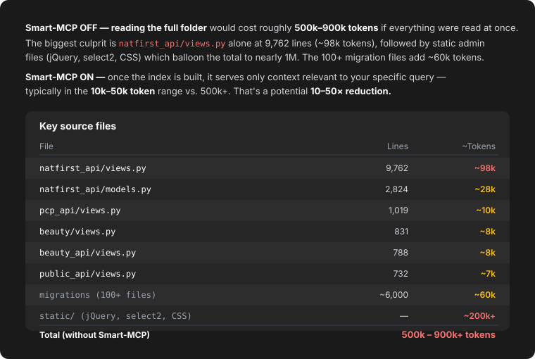

# Smart MCP Token Optimizer

Smart MCP is a **local MCP retrieval engine** designed to **reduce token usage** for AI coding agents like Claude Code, Codex, Cursor, Continue, and any MCP-compatible AI.

It automatically indexes repositories and returns only **minimal relevant context**, so AI agents do not load entire files or huge repositories unnecessarily.

The main goal of this project is simple:

Instead of sending entire repositories or huge files to the LLM, Smart MCP retrieves only the minimum relevant code context required for the task.

This reduces:

* token usage
* AI cost
* context pollution
* repeated file loading
* latency during AI coding workflows

---

# Problem

Large repositories create huge token waste.

Example:

A Django project may contain:

* large `views.py`
* large `serializers.py`
* static vendor assets
* migrations
* repeated boilerplate
* unrelated modules

Without retrieval optimization, AI agents repeatedly reload:

* huge files
* unrelated APIs
* repeated imports
* unnecessary serializers
* static assets

This causes:

* massive token usage
* slower responses
* worse reasoning quality
* unstable long AI sessions

---

# Solution

Smart MCP creates a retrieval layer between the repository and the AI model.

Instead of this:

```text
Repository → Full Context → LLM
```

Smart MCP does this:

```text
Repository
→ AST Parsing
→ Symbol Extraction
→ Chunking
→ BM25 Retrieval
→ Embedding Search
→ FAISS Vector Search
→ Graph Expansion
→ Context Compression
→ Minimal Relevant Context
→ LLM
```

The AI receives only the most relevant:

* functions
* classes
* APIs
* services
* dependency-related chunks

```text
┌───────────────┐
│   AI Query    │
└───────┬───────┘
        │
        ▼
┌───────────────┐
│ Check Index   │
│ (Already done?)│
└───────┬───────┘
        │ No → Auto-Index
        ▼
┌───────────────┐
│ File Scan     │
│ AST Parsing   │
│ Chunking      │
│ Embedding     │
│ Vector Index  │
│ Graph Build   │
└───────┬───────┘
        │
        ▼
┌───────────────┐
│ Hybrid Search │
│ BM25 + FAISS  │
│ Re-ranking    │
│ Context Compress│
└───────┬───────┘
        │
        ▼
┌───────────────┐
│ Minimal Context│
│ sent to AI    │
└───────────────┘
```

---

# Main Features

## Hybrid Retrieval

Combines:

* BM25 keyword retrieval
* embedding similarity search
* FAISS vector retrieval

This improves retrieval quality significantly.

---

## AST-Based Chunking

Large files are automatically split into:

* function chunks
* class chunks
* symbol chunks

Example:

Instead of sending:

```text
views.py → 100K tokens
```

Smart MCP sends:

```text
authenticate_user()
generate_jwt()
validate_token()
```

only when required.

This is one of the biggest token reduction improvements.

---

## Automatic Noise Reduction

The engine automatically excludes noisy folders:

```text
static/
node_modules/
.git/
dist/
build/
coverage/
migrations/
__pycache__/
.next/
.dart_tool/
```

This improves:

* retrieval quality
* embedding quality
* indexing speed
* semantic relevance

---

## Incremental Indexing

Only changed files are re-indexed.

This improves:

* indexing speed
* retrieval freshness
* repository scalability

---

## Graph-Aware Retrieval

The engine builds repository relationships between:

* functions
* classes
* dependencies

This improves retrieval relevance for:

* API tracing
* bug fixing
* feature implementation

---

## Local First

Everything runs locally.

No repository data is uploaded externally.

This works well for:

* enterprise repositories
* private codebases
* large local development environments

---

# Supported Frameworks

## Backend Frameworks

* Django
* FastAPI
* Flask
* Node.js Express APIs

---

## Frontend Frameworks

* React
* Next.js
* TypeScript projects

---

## Mobile Frameworks

* Flutter

---

# Token Reduction

Smart MCP drastically reduces token usage:

| Workflow | Without Smart-MCP | With Smart-MCP |
|----------|-------------------|----------------|
| Bug fix | 40K–120K tokens | 3K–12K tokens |
| Feature addition | 80K tokens | 10K tokens |
| Multi-step coding | 500K+ tokens | 60K tokens |

**Estimated reduction:** 70%–92% on large repositories.

---

# Token Reduction Impact

Estimated reduction after Smart MCP integration:

| Repository Size | Estimated Reduction |
| --------------- | ------------------- |
| Small repos     | 30% to 50%          |
| Medium repos    | 50% to 75%          |
| Large repos     | 70% to 92%          |

---

# Real-World Token Analysis

The diagram below shows a real token analysis of a large Django API repository — comparing what it costs to read the folder **with Smart-MCP OFF vs ON**.



**Smart-MCP OFF** — reading the full folder would cost roughly **500k–900k tokens** if everything were read at once. The biggest culprit is `natfirst_api/views.py` alone at 9,762 lines (~98k tokens), followed by the static admin files (jQuery, select2, CSS) which balloon the total to nearly 1M. The 100+ migration files add another ~60k tokens despite being individually small.

**Smart-MCP ON** — once the index is built, it serves only context relevant to your specific query — typically in the **10k–50k token** range vs. 500k+. That's a potential **10–50× reduction**.

---

# Automatic Indexing Flow

```text
AI Query
→ Smart MCP checks if repository is indexed
→ If not, automatically indexes repository:
   • File scan
   • AST parsing
   • Chunk creation
   • Embedding & vector index
   • Dependency graph creation
→ Retrieval pipeline:
   • BM25 + FAISS vector search
   • Cross-encoder re-ranking
   • Context compression
→ Minimal relevant context returned to AI
```

---

# Real Example

## Without Smart MCP

AI receives:

```text
views.py
serializers.py
models.py
settings.py
middleware.py
urls.py
```

Estimated:

```text
40K to 120K tokens
```

per workflow.

---

## With Smart MCP

AI receives only:

```text
authenticate_user()
jwt_validator()
login_serializer()
token_service()
```

Estimated:

```text
3K to 12K tokens
```

per workflow.

---

# Why This Matters

Benefits:

* lower AI cost
* faster responses
* higher retrieval quality
* less context pollution
* better long-running AI sessions
* improved repository understanding

---

# Repository Structure

```text
app/
├── chunking/
├── core/
├── mcp/
├── parsers/
├── storage/
├── watchers/
```

---

# Core Components

| Component           | Purpose                   |
| ------------------- | ------------------------- |
| AST Parser          | Extract functions/classes |
| Chunker             | Split large files         |
| Hybrid Retriever    | Semantic retrieval        |
| FAISS Store         | Vector search             |
| Graph Engine        | Dependency traversal      |
| Incremental Indexer | Fast re-indexing          |
| MCP Server          | AI integration            |

---

# Installation

## 1. Create Virtual Environment

Windows:

```bash
python -m venv venv
venv\Scripts\activate
```

Linux/macOS:

```bash
python3 -m venv venv
source venv/bin/activate
```

---

## 2. Install Dependencies

```bash
pip install -r requirements.txt
```

---

# Setup — Automatic (Recommended)

Instead of manually building the index and starting the MCP server, use the built-in setup commands to run everything automatically.

---

## setup_global

Sets up Smart MCP **globally** — registers the MCP server so it is available across all projects on your machine without repeating setup per repository.

```python
from app.core.setup import setup_global

setup_global()
```

What it does automatically:

* installs MCP server configuration globally
* registers Smart MCP as a globally available tool for Claude Code, Codex, and Cursor
* no manual `mcp.json` editing required
* works across all repositories on your machine

---

## setup_project

Sets up Smart MCP **for a specific project** — indexes the repository and starts the MCP server automatically for that project only.

```python
from app.core.setup import setup_project

setup_project(path="C:/projects/myrepo")
```

What it does automatically:

* scans the repository
* excludes noisy folders (`static/`, `migrations/`, `node_modules/`, etc.)
* parses symbols via AST
* builds chunks
* generates embeddings
* creates the FAISS vector index
* builds the dependency graph
* starts the MCP server
* ready for AI queries immediately

---

## Comparison: Manual vs Automatic

| Step | Manual | `setup_global` / `setup_project` |
|------|--------|----------------------------------|
| Build index | `python -m app.main` | Automatic |
| Start MCP server | `python -m app.mcp.server` | Automatic |
| Configure `mcp.json` | Edit manually | Automatic |
| Ready for AI | After all steps | Immediately |

---

# Build Repository Index (Manual)

If you prefer manual control, run:

```bash
python -m app.main
```

Then enter your repository path:

```text
C:\projects\myrepo
```

or

```text
/home/user/myrepo
```

The engine will:

* scan repository
* exclude noisy folders
* parse symbols
* build chunks
* generate embeddings
* create vector index
* prepare retrieval engine

---

# Run MCP Server (Manual)

```bash
python -m app.mcp.server
```

The MCP server starts locally.

---

# Claude Code Integration

Add MCP configuration:

```json
{
  "mcpServers": {
    "smart-mcp": {
      "command": "python",
      "args": [
        "-m",
        "app.mcp.server"
      ]
    }
  }
}
```

Usually added in:

```text
.claude/mcp.json
```

---

# Codex Integration

Run MCP server separately:

```bash
python -m app.mcp.server
```

Then configure the coding agent to use:

* `search_context`
* semantic retrieval tools

---

# Recommended Workflow

```text
Repository
→ Run setup_project(path="...") OR setup_global()
→ Smart MCP indexes and starts automatically
→ Connect Claude / Codex / Cursor
→ AI retrieves only relevant chunks
→ Reduced token usage
→ Faster coding workflow
```

---

# Current Focus

This project focuses only on:

* token reduction
* semantic retrieval
* repository chunking
* context minimization
* AI coding optimization

---

# Future Improvements

Planned improvements:

* deeper AST relationships
* advanced graph traversal
* route-to-view mapping
* serializer-model linking
* persistent vector databases
* better reranking
* repository benchmark suite
* advanced semantic compression
* multi-repository memory
